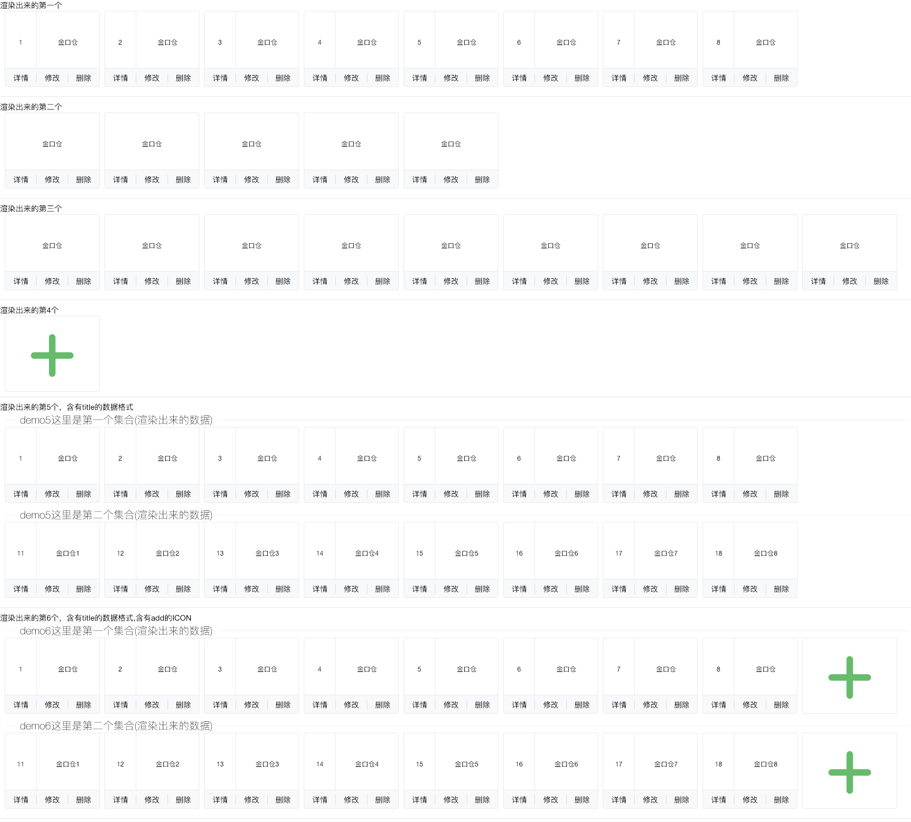

## card组件

#### 1. 快速使用

> 组件名称

```
PlgCard
```

> 需要引入的文件

```
  <link rel="stylesheet" type="text/css" href="../../../modules/layui-master/dist/css/layui.css" />
  <link rel="stylesheet" href="../../../assets/styles/css/plgui.css" />
  <script src="../../../modules/jquery/jquery.js" type="text/javascript" charset="utf-8"></script>
  <script src="../../../modules/layui-master/dist/layui.all.js"></script>
  <script src="../../../core/plgcore.js" type="text/javascript" charset="utf-8"></script>
  <script src="../../../components/PlgCard/codebase/PlgCard.js" type="text/javascript" charset="utf-8"></script>

```

<h4 style="color: blue">1.1 示例-card简洁风格</h4>




```
  <h3>渲染出来的第一个</h3>
  <div id="demo"></div>

  <hr />
  <h3>渲染出来的第二个</h3>
  <div id="demo2"></div>

  <hr />
  <h3>渲染出来的第三个</h3>
  <div id="demo3"></div>

  <hr />
  <h3>渲染出来的第4个</h3>
  <div id="demo4"></div>

  <hr />
  <h3>渲染出来的第5个，含有title的数据格式</h3>
  <div id="demo5"></div>

  <hr />
  <h3>渲染出来的第6个，含有title的数据格式,含有add的ICON</h3>
  <div id="demo6"></div>

    <script>
    // 上传【 音频/视频】文件 
    var config = {
      renderer: 'demo',
      config: {
        style: 'one', // one. two, three, add 
        data: [{
            cardNo: 1,
            cardName: '金口仓',
            btn: [{
                text: '详情',
                fn: 'detailsFn',
              },
              {
                text: '修改',
                fn: 'updateFn',
              },
              {
                text: '删除',
                fn: 'delFn',
              }
            ]
          },
          {
            cardNo: 2,
            cardName: '金口仓',
            btn: [{
                text: '详情',
                fn: 'detailsFn',
              },
              {
                text: '修改',
                fn: 'updateFn',
              },
              {
                text: '删除',
                fn: 'delFn',
              }
            ]
          },
          {
            cardNo: 3,
            cardName: '金口仓',
            btn: [{
                text: '详情',
                fn: 'detailsFn',
              },
              {
                text: '修改',
                fn: 'updateFn',
              },
              {
                text: '删除',
                fn: 'delFn',
              }
            ]
          },
          {
            cardNo: 4,
            cardName: '金口仓',
            btn: [{
                text: '详情',
                fn: 'detailsFn',
              },
              {
                text: '修改',
                fn: 'updateFn',
              },
              {
                text: '删除',
                fn: 'delFn',
              }
            ]
          },
          {
            cardNo: 5,
            cardName: '金口仓',
            btn: [{
                text: '详情',
                fn: 'detailsFn',
              },
              {
                text: '修改',
                fn: 'updateFn',
              },
              {
                text: '删除',
                fn: 'delFn',
              }
            ]
          },
          {
            cardNo: 6,
            cardName: '金口仓',
            btn: [{
                text: '详情',
                fn: 'detailsFn',
              },
              {
                text: '修改',
                fn: 'updateFn',
              },
              {
                text: '删除',
                fn: 'delFn',
              }
            ]
          },
          {
            cardNo: 7,
            cardName: '金口仓',
            btn: [{
                text: '详情',
                fn: 'detailsFn',
              },
              {
                text: '修改',
                fn: 'updateFn',
              },
              {
                text: '删除',
                fn: 'delFn',
              }
            ]
          },
          {
            cardNo: 8,
            cardName: '金口仓',
            btn: [{
                text: '详情',
                fn: 'detailsFn',
              },
              {
                text: '修改',
                fn: 'updateFn',
              },
              {
                text: '删除',
                fn: 'delFn',
              }
            ]
          }
        ]
      }
    }


    var plg1 = new PlgCard(config);

    /** 
     * ind 当前的点击的是记录的cardNo值
     * callBackFn，当前点击按钮之后做什么操作
     * **/
    plg1.on("click", function (ind, callBackFn) {
      //console.log('ind::' + ind);
      //console.log('callBackFn::' + callBackFn);
    });


    var config2 = {
      renderer: 'demo2',
      config: {
        style: 'two', // one. two, three, add 
        data: [{
            cardNo: 1,
            cardName: '金口仓',
            btn: [{
                text: '详情',
                fn: 'detailsFn',
              },
              {
                text: '修改',
                fn: 'updateFn',
              },
              {
                text: '删除',
                fn: 'delFn',
              }
            ]
          },
          {
            cardNo: 2,
            cardName: '金口仓',
            btn: [{
                text: '详情',
                fn: 'detailsFn',
              },
              {
                text: '修改',
                fn: 'updateFn',
              },
              {
                text: '删除',
                fn: 'delFn',
              }
            ]
          },
          {
            cardNo: 3,
            cardName: '金口仓',
            btn: [{
                text: '详情',
                fn: 'detailsFn',
              },
              {
                text: '修改',
                fn: 'updateFn',
              },
              {
                text: '删除',
                fn: 'delFn',
              }
            ]
          },
          {
            cardNo: 4,
            cardName: '金口仓',
            btn: [{
                text: '详情',
                fn: 'detailsFn',
              },
              {
                text: '修改',
                fn: 'updateFn',
              },
              {
                text: '删除',
                fn: 'delFn',
              }
            ]
          },
          {
            cardNo: 5,
            cardName: '金口仓',
            btn: [{
                text: '详情',
                fn: 'detailsFn',
              },
              {
                text: '修改',
                fn: 'updateFn',
              },
              {
                text: '删除',
                fn: 'delFn',
              }
            ]
          }
        ]
      }
    }


    var plg2 = new PlgCard(config2);


    var config3 = {
      renderer: 'demo3',
      config: {
        style: 'three', // one. two, three, add 
        data: [{
            cardNo: 1,
            cardName: '金口仓',
            btn: [{
                text: '详情',
                fn: 'detailsFn',
              },
              {
                text: '修改',
                fn: 'updateFn',
              },
              {
                text: '删除',
                fn: 'delFn',
              }
            ]
          },
          {
            cardNo: 2,
            cardName: '金口仓',
            btn: [{
                text: '详情',
                fn: 'detailsFn',
              },
              {
                text: '修改',
                fn: 'updateFn',
              },
              {
                text: '删除',
                fn: 'delFn',
              }
            ]
          },
          {
            cardNo: 3,
            cardName: '金口仓',
            btn: [{
                text: '详情',
                fn: 'detailsFn',
              },
              {
                text: '修改',
                fn: 'updateFn',
              },
              {
                text: '删除',
                fn: 'delFn',
              }
            ]
          },
          {
            cardNo: 4,
            cardName: '金口仓',
            btn: [{
                text: '详情',
                fn: 'detailsFn',
              },
              {
                text: '修改',
                fn: 'updateFn',
              },
              {
                text: '删除',
                fn: 'delFn',
              }
            ]
          },
          {
            cardNo: 5,
            cardName: '金口仓',
            btn: [{
                text: '详情',
                fn: 'detailsFn',
              },
              {
                text: '修改',
                fn: 'updateFn',
              },
              {
                text: '删除',
                fn: 'delFn',
              }
            ]
          },
          {
            cardNo: 6,
            cardName: '金口仓',
            btn: [{
                text: '详情',
                fn: 'detailsFn',
              },
              {
                text: '修改',
                fn: 'updateFn',
              },
              {
                text: '删除',
                fn: 'delFn',
              }
            ]
          },
          {
            cardNo: 7,
            cardName: '金口仓',
            btn: [{
                text: '详情',
                fn: 'detailsFn',
              },
              {
                text: '修改',
                fn: 'updateFn',
              },
              {
                text: '删除',
                fn: 'delFn',
              }
            ]
          },
          {
            cardNo: 8,
            cardName: '金口仓',
            btn: [{
                text: '详情',
                fn: 'detailsFn',
              },
              {
                text: '修改',
                fn: 'updateFn',
              },
              {
                text: '删除',
                fn: 'delFn',
              }
            ]
          },
          {
            cardNo: 9,
            cardName: '金口仓',
            btn: [{
                text: '详情',
                fn: 'detailsFn',
              },
              {
                text: '修改',
                fn: 'updateFn',
              },
              {
                text: '删除',
                fn: 'delFn',
              }
            ]
          }
        ]
      }
    }


    var plg3 = new PlgCard(config3);

    var config4 = {
      renderer: 'demo4',
      config: {
        style: 'add', // one. two, three, add 
        fn: addFn
      }
    }


    var plg4 = new PlgCard(config4);
    /** 
     * style的值是【add】的时候就爱干嘛干嘛了，广阔天地自由翱翔
     * **/
    plg4.on("click", function () {

      //console.log('爱干嘛干嘛，自由自在真好');

    });


    var config5 = {
      renderer: 'demo5',
      config: {
        style: 'oneTitle', // one. two, three, add 
        data: [{
            title: 'demo5这里是第一个集合(渲染出来的数据)',
            dataList: [
              {
                cardNo: 1,
                cardName: '金口仓',
                btn: [{
                    text: '详情',
                    fn: 'detailsFn',
                  },
                  {
                    text: '修改',
                    fn: 'updateFn',
                  },
                  {
                    text: '删除',
                    fn: 'delFn',
                  }
                ]
              },
              {
                cardNo: 2,
                cardName: '金口仓',
                btn: [{
                    text: '详情',
                    fn: 'detailsFn',
                  },
                  {
                    text: '修改',
                    fn: 'updateFn',
                  },
                  {
                    text: '删除',
                    fn: 'delFn',
                  }
                ]
              },
              {
                cardNo: 3,
                cardName: '金口仓',
                btn: [{
                    text: '详情',
                    fn: 'detailsFn',
                  },
                  {
                    text: '修改',
                    fn: 'updateFn',
                  },
                  {
                    text: '删除',
                    fn: 'delFn',
                  }
                ]
              },
              {
                cardNo: 4,
                cardName: '金口仓',
                btn: [{
                    text: '详情',
                    fn: 'detailsFn',
                  },
                  {
                    text: '修改',
                    fn: 'updateFn',
                  },
                  {
                    text: '删除',
                    fn: 'delFn',
                  }
                ]
              },
              {
                cardNo: 5,
                cardName: '金口仓',
                btn: [{
                    text: '详情',
                    fn: 'detailsFn',
                  },
                  {
                    text: '修改',
                    fn: 'updateFn',
                  },
                  {
                    text: '删除',
                    fn: 'delFn',
                  }
                ]
              },
              {
                cardNo: 6,
                cardName: '金口仓',
                btn: [{
                    text: '详情',
                    fn: 'detailsFn',
                  },
                  {
                    text: '修改',
                    fn: 'updateFn',
                  },
                  {
                    text: '删除',
                    fn: 'delFn',
                  }
                ]
              },
              {
                cardNo: 7,
                cardName: '金口仓',
                btn: [{
                    text: '详情',
                    fn: 'detailsFn',
                  },
                  {
                    text: '修改',
                    fn: 'updateFn',
                  },
                  {
                    text: '删除',
                    fn: 'delFn',
                  }
                ]
              },
              {
                cardNo: 8,
                cardName: '金口仓',
                btn: [{
                    text: '详情',
                    fn: 'detailsFn',
                  },
                  {
                    text: '修改',
                    fn: 'updateFn',
                  },
                  {
                    text: '删除',
                    fn: 'delFn',
                  }
                ]
              }
            ]
          },
          {
            title: 'demo5这里是第二个集合(渲染出来的数据)',
            dataList: [
              {
                cardNo: 11,
                cardName: '金口仓1',
                btn: [{
                    text: '详情',
                    fn: 'detailsFn',
                  },
                  {
                    text: '修改',
                    fn: 'updateFn',
                  },
                  {
                    text: '删除',
                    fn: 'delFn',
                  }
                ]
              },
              {
                cardNo: 12,
                cardName: '金口仓2',
                btn: [{
                    text: '详情',
                    fn: 'detailsFn',
                  },
                  {
                    text: '修改',
                    fn: 'updateFn',
                  },
                  {
                    text: '删除',
                    fn: 'delFn',
                  }
                ]
              },
              {
                cardNo: 13,
                cardName: '金口仓3',
                btn: [{
                    text: '详情',
                    fn: 'detailsFn',
                  },
                  {
                    text: '修改',
                    fn: 'updateFn',
                  },
                  {
                    text: '删除',
                    fn: 'delFn',
                  }
                ]
              },
              {
                cardNo: 14,
                cardName: '金口仓4',
                btn: [{
                    text: '详情',
                    fn: 'detailsFn',
                  },
                  {
                    text: '修改',
                    fn: 'updateFn',
                  },
                  {
                    text: '删除',
                    fn: 'delFn',
                  }
                ]
              },
              {
                cardNo: 15,
                cardName: '金口仓5',
                btn: [{
                    text: '详情',
                    fn: 'detailsFn',
                  },
                  {
                    text: '修改',
                    fn: 'updateFn',
                  },
                  {
                    text: '删除',
                    fn: 'delFn',
                  }
                ]
              },
              {
                cardNo: 16,
                cardName: '金口仓6',
                btn: [{
                    text: '详情',
                    fn: 'detailsFn',
                  },
                  {
                    text: '修改',
                    fn: 'updateFn',
                  },
                  {
                    text: '删除',
                    fn: 'delFn',
                  }
                ]
              },
              {
                cardNo: 17,
                cardName: '金口仓7',
                btn: [{
                    text: '详情',
                    fn: 'detailsFn',
                  },
                  {
                    text: '修改',
                    fn: 'updateFn',
                  },
                  {
                    text: '删除',
                    fn: 'delFn',
                  }
                ]
              },
              {
                cardNo: 18,
                cardName: '金口仓8',
                btn: [{
                    text: '详情',
                    fn: 'detailsFn',
                  },
                  {
                    text: '修改',
                    fn: 'updateFn',
                  },
                  {
                    text: '删除',
                    fn: 'delFn',
                  }
                ]
              }
            ]
          }

        ]
      }
    }


    var plg5 = new PlgCard(config5);
    plg5.on("click", function (ind, callBackFn) {
      //console.log('ind::' + ind);
      //console.log('callBackFn::' + callBackFn);
    });

    var config6 = {
      renderer: 'demo6',
      config: {
        style: 'oneTitleAdd', // one. two, three, add 
        data: [{
            title: 'demo6这里是第一个集合(渲染出来的数据)',
            dataList: [
              {
                cardNo: 1,
                cardName: '金口仓',
                btn: [{
                    text: '详情',
                    fn: 'detailsFn',
                  },
                  {
                    text: '修改',
                    fn: 'updateFn',
                  },
                  {
                    text: '删除',
                    fn: 'delFn',
                  }
                ]
              },
              {
                cardNo: 2,
                cardName: '金口仓',
                btn: [{
                    text: '详情',
                    fn: 'detailsFn',
                  },
                  {
                    text: '修改',
                    fn: 'updateFn',
                  },
                  {
                    text: '删除',
                    fn: 'delFn',
                  }
                ]
              },
              {
                cardNo: 3,
                cardName: '金口仓',
                btn: [{
                    text: '详情',
                    fn: 'detailsFn',
                  },
                  {
                    text: '修改',
                    fn: 'updateFn',
                  },
                  {
                    text: '删除',
                    fn: 'delFn',
                  }
                ]
              },
              {
                cardNo: 4,
                cardName: '金口仓',
                btn: [{
                    text: '详情',
                    fn: 'detailsFn',
                  },
                  {
                    text: '修改',
                    fn: 'updateFn',
                  },
                  {
                    text: '删除',
                    fn: 'delFn',
                  }
                ]
              },
              {
                cardNo: 5,
                cardName: '金口仓',
                btn: [{
                    text: '详情',
                    fn: 'detailsFn',
                  },
                  {
                    text: '修改',
                    fn: 'updateFn',
                  },
                  {
                    text: '删除',
                    fn: 'delFn',
                  }
                ]
              },
              {
                cardNo: 6,
                cardName: '金口仓',
                btn: [{
                    text: '详情',
                    fn: 'detailsFn',
                  },
                  {
                    text: '修改',
                    fn: 'updateFn',
                  },
                  {
                    text: '删除',
                    fn: 'delFn',
                  }
                ]
              },
              {
                cardNo: 7,
                cardName: '金口仓',
                btn: [{
                    text: '详情',
                    fn: 'detailsFn',
                  },
                  {
                    text: '修改',
                    fn: 'updateFn',
                  },
                  {
                    text: '删除',
                    fn: 'delFn',
                  }
                ]
              },
              {
                cardNo: 8,
                cardName: '金口仓',
                btn: [{
                    text: '详情',
                    fn: 'detailsFn',
                  },
                  {
                    text: '修改',
                    fn: 'updateFn',
                  },
                  {
                    text: '删除',
                    fn: 'delFn',
                  }
                ]
              }
            ]
          },
          {
            title: 'demo6这里是第二个集合(渲染出来的数据)',
            dataList: [
              {
                cardNo: 11,
                cardName: '金口仓1',
                btn: [{
                    text: '详情',
                    fn: 'detailsFn',
                  },
                  {
                    text: '修改',
                    fn: 'updateFn',
                  },
                  {
                    text: '删除',
                    fn: 'delFn',
                  }
                ]
              },
              {
                cardNo: 12,
                cardName: '金口仓2',
                btn: [{
                    text: '详情',
                    fn: 'detailsFn',
                  },
                  {
                    text: '修改',
                    fn: 'updateFn',
                  },
                  {
                    text: '删除',
                    fn: 'delFn',
                  }
                ]
              },
              {
                cardNo: 13,
                cardName: '金口仓3',
                btn: [{
                    text: '详情',
                    fn: 'detailsFn',
                  },
                  {
                    text: '修改',
                    fn: 'updateFn',
                  },
                  {
                    text: '删除',
                    fn: 'delFn',
                  }
                ]
              },
              {
                cardNo: 14,
                cardName: '金口仓4',
                btn: [{
                    text: '详情',
                    fn: 'detailsFn',
                  },
                  {
                    text: '修改',
                    fn: 'updateFn',
                  },
                  {
                    text: '删除',
                    fn: 'delFn',
                  }
                ]
              },
              {
                cardNo: 15,
                cardName: '金口仓5',
                btn: [{
                    text: '详情',
                    fn: 'detailsFn',
                  },
                  {
                    text: '修改',
                    fn: 'updateFn',
                  },
                  {
                    text: '删除',
                    fn: 'delFn',
                  }
                ]
              },
              {
                cardNo: 16,
                cardName: '金口仓6',
                btn: [{
                    text: '详情',
                    fn: 'detailsFn',
                  },
                  {
                    text: '修改',
                    fn: 'updateFn',
                  },
                  {
                    text: '删除',
                    fn: 'delFn',
                  }
                ]
              },
              {
                cardNo: 17,
                cardName: '金口仓7',
                btn: [{
                    text: '详情',
                    fn: 'detailsFn',
                  },
                  {
                    text: '修改',
                    fn: 'updateFn',
                  },
                  {
                    text: '删除',
                    fn: 'delFn',
                  }
                ]
              },
              {
                cardNo: 18,
                cardName: '金口仓8',
                btn: [{
                    text: '详情',
                    fn: 'detailsFn',
                  },
                  {
                    text: '修改',
                    fn: 'updateFn',
                  },
                  {
                    text: '删除',
                    fn: 'delFn',
                  }
                ]
              }
            ]
          }

        ]
      }
    }


    var plg6 = new PlgCard(config6);
    plg6.on("click", function (ind, callBackFn, title) {
      // 如果是add图标的时候，ind, callBackFn都是undefined
      //console.log('ind::' + ind);
      //console.log('callBackFn::' + callBackFn);
      //console.log('title::' + title);
    });


    function detailsFn() {
      //console.log('details');
    }

    function updateFn() {
      //console.log('update');
    }

    function delFn() {
      //console.log('delFn');
    }


    function addFn() {
      //console.log('addFn');
    }
  </script>
```


### 2. 配置参数

| 名称            | 类型        | 说明                                                         |
| --------------- | ----------- | ------------------------------------------------------------ |
| renderer        | String      | document 挂载 "id"（必填）                                   |
| config          | Object      | 配置文件的主要参数                                           |
| config.style    | String      | 【one】【two】【three】【add】【oneTitle】【oneTitleAdd】【threeTitle】，此处根据设计稿的不同展示的形式不同 |
| config.fn       | String      | config.style是【add】的时候，点击右上角【add】按钮会触发此事件，此事件不是非必须的。 |
| config.data     | ArrayObject | cardNo: 1, (当前card的id，由后台提供，必需要)<br />cardName: '金口仓'(当前仓库的名字，由后台提供，必须要)<br /> |
| config.data.btn | ArrayObject | text: '详情', (按钮显示的文案，必需要)<br />fn: 'detailsFn'(点击按钮，触发的事件)<br /> |

### 3. 实例方法

| 方法                                                         | 说明                                                         |
| ------------------------------------------------------------ | ------------------------------------------------------------ |
| var plg5 = new PlgCard(config5);<br />  plg5.on("click", function (ind, callBackFn) {<br />}<br />    function detailsFn() {}<br />function updateFn() {}<br />function delFn() {}<br />function addFn() {}<br /> | 给是实例绑定click事件，返回当前点击的cardNo，和要执行的回调函数 |


