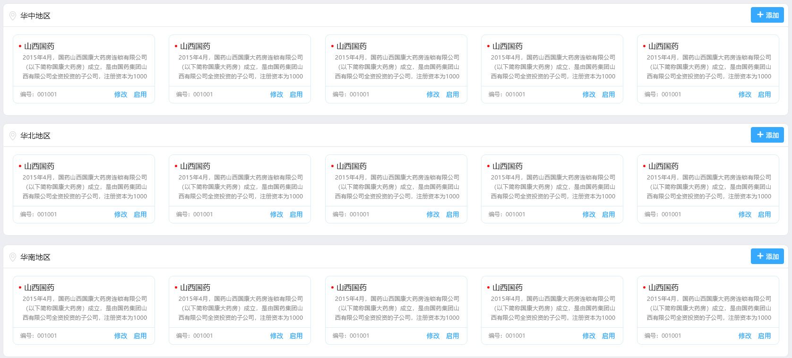

## cardList组件

#### 1. 快速使用

> 组件名称

```
PlgCardList
```

> 需要引入的文件

```
  <link rel="stylesheet" href="../vendors/layui-master/dist/css/layui.css" />
  <link rel="stylesheet" href="../dist/css/plg.css" />
  <script src="../vendors/jquery/jquery-3.3.1.min.js"></script>
  <script src="../dist/js/plg.js"></script>
```

<h4 style="color: blue">1.1 示例-cardList简洁风格</h4>




```
<div id="demo"></div>

  <script>
    var config = {
      renderer: 'demo',
      data: {
        zoneId: 1,
        zoneName: '华中地区',
        isShowAdd: true,
        customerList: [{
            id: 1,
            name: '山西国药',
            description: '2015年4月，国药山西国康大药房连锁有限公司（以下简称国康大药房）成立，是由国药集团山西有限公司全资投资的子公司，注册资本为1000万元',
            useNo: 3000,
            btns: {
              del: '删除',
              update: '更新',
              run: '运行'
            }
          },
          {
            id: 2,
            name: '山西国药',
            description: '2015年4月，注册资本为1000万元',
            useNo: 3000,
            btns: {
              del: '删除',
              update: '更新',
              run: '运行'
            }
          },
          {
            id: 3,
            name: '山西国药',
            description: '2015年4月，国药山西国康大药房连锁有限公司（以下简称国康大药房）成立，是由国药集团山西有限公司全资投资的子公司，注册资本为1000万元',
            useNo: 3000,
            btns: {
              del: '删除',
              update: '更新',
              run: '运行'
            }
          },
          {
            id: 4,
            name: '山西国药',
            description: '2015年4月，国药山西国康大药房连锁有限公司（以下简称国康大药房）成立，是由国药集团山西有限公司全资投资的子公司，注册资本为1000万元',
            useNo: 3000,
            btns: {
              del: '删除',
              update: '更新',
              run: '运行'
            }
          },
          {
            id: 5,
            name: '山西国药',
            description: '2015年4月，国药山西国康大药房连锁有限公司（以下简称国康大药房）成立，是由国药集团山西有限公司全资投资的子公司，注册资本为1000万元',
            useNo: 3000,
            btns: {
              del: '删除',
              update: '更新',
              run: '运行'
            }
          },
          {
            id: 6,
            name: '山西国药',
            description: '2015年4月，国药山西国康大药房连锁有限公司（以下简称国康大药房）成立，是由国药集团山西有限公司全资投资的子公司，注册资本为1000万元',
            useNo: 3000,
            btns: {
              del: '删除',
              update: '更新',
              run: '运行'
            }
          },
          {
            id: 7,
            name: '山西国药山西国药山西国药山西国药山西国药山西国药山西国药山西国药',
            description: '2015年4月，国药山西国康大药房连锁有限公司（以下简称国康大药房）成立，是由国药集团山西有限公司全资投资的子公司，注册资本为1000万元',
            useNo: 3000,
            btns: {
              del: '删除',
              update: '更新',
              run: '运行'
            }
          }
        ]
      }
    }

    var plgCard = new PlgCardList(config);
    
    
    plgCard.on('add', function(ind){
      console.log('需要知道当前点击的是那个::' + ind);
    })
    plgCard.on('run', function(ind){
      console.log('这里是run事件::' + ind);
    })
    plgCard.on('del', function(ind){
      console.log('这里是del事件::' + ind);
    })
    plgCard.on('update', function(ind){
      console.log('这里是update事件::' + ind);
    })
   
  </script>
```


### 2. 配置参数

| 名称     | 类型   | 说明                                                         |
| -------- | ------ | ------------------------------------------------------------ |
| renderer | String | document 挂载 "id"（必填）                                   |
| data     | Object | zoneId: 1, (当前区域的id，由后台提供)<br/>zoneName: '华中地区',（区域名）<br/>isShowAdd: true, （是否显示右上角的【添加】按钮，默认显示）<br/>customerList: [{  (用户数据的信息)<br/>id: 1,  （当前记录的id）<br/>name: '山西国药', （当前记录的名称）<br/>description: '2015年4月，国药山西国康大药房连锁有限公司（以下简称国康大药房）成立，是由国药集团山西有限公司全资投资的子公司，注册资本为1000万元', （当前记录的描述说明）<br/>useNo: 3000, （当前记录的编号）<br/>btns: { （当前记录的按钮功能）<br/>del: '删除',（当前记录的按钮功能--删除）<br/>update: '更新',（当前记录的按钮功能--更新）<br/>run: '运行'（当前记录的按钮功能--运行）<br/>}<br/>}] |

### 3. 实例方法

| 方法              | 说明                         |
| ----------------- | ---------------------------- |
| plgCard.on(eventName, callback) | 给当前的数据绑定参数，<br />【add】右上角的添加按钮<br />【run】当前数据单元右下角的【运行】按钮<br />【del】当前数据单元右下角的【删除】按钮<<br />【update】当前数据单元右下角的【更新】按钮 |


