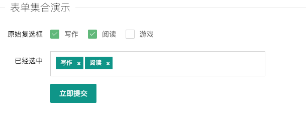

## inputTags组件

#### 1. 快速使用

> 组件名称

```
PlgInputTags
```

> 需要引入的文件

```
  <link rel="stylesheet" href="../../../modules/layui-master/dist/css/layui.css" />
  <link rel="stylesheet" href="../codebase/PlgInputTags.css" />
  <script src="../../../modules/jquery/jquery.js"></script>
  <script src="../../../modules/layui-master/dist/layui.all.js"></script>
  <script src="../../../core/plgcore.js"></script>
  <script src="../codebase/PlgInputTags.js"></script>
```

<h4 style="color: blue">1.1 示例-inputTags简洁风格</h4>




```
    <form class="layui-form" action="" >
    <div id="plg-layui-from"></div>

    <div>
      <div class="layui-form-item">
        <div class="layui-input-block">
          <button class="layui-btn" lay-submit="" lay-filter="demo1">
            立即提交
          </button>
        </div>
      </div>
    </div>
  </form>


  <script>
    var config = {
      renderer: 'plg-layui-from',
      checkboxName: 'like',
      layFilter: "plg",
      data: [
        {
          alias: 'write',
          text: '写作',
          checked: true    // 可以设置默认值
        },{
          alias: 'read',
          text: '阅读'
          
        },{
          alias: 'game',
          text: '游戏',
          checked: false
        },
      ]
    }

    var plg = new PlgInputTags(config);
  
  </script>
```


### 2. 配置参数

| 名称         | 类型        | 说明                                                         |
| ------------ | ----------- | ------------------------------------------------------------ |
| renderer     | String      | document 挂载 "id"（必填）                                   |
| checkboxName | String      | 获取checkbox的name，主要是表单提交的时候获取的值（必填）     |
| layFilter    | String      | layui.form获取监听的时候获取的值，给layui绑定事件监听使用（默认采用随机生成的字符串，非必填） |
| data         | ArrayObject | alias: 'test', (当前标签别称)<br />text: 1，（当前标签名称）<br />checked: 'false', (当前标签是否被选中，默认为false) <br /> |