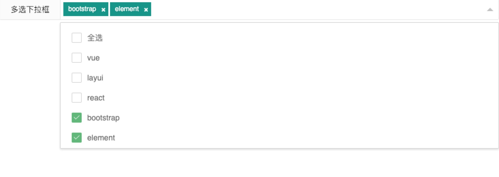

## selectTags组件

#### 1. 快速使用

> 组件名称

```
PlgSelectTags
```

> 需要引入的文件

```
  <link rel="stylesheet" href="../vendors/layui-master/dist/css/layui.css" />
  <link rel="stylesheet" href="../dist/css/plg.css" />
  <script src="../vendors/jquery/jquery-3.3.1.min.js"></script>
  <script src="../vendors/layui-master/dist/layui.all.js"></script>
  <script src="../dist/js/plg.js"></script>
```

<h4 style="color: blue">1.1 示例-selectTags简洁风格</h4>




```
  <form class="layui-form layui-form-pane" action="">
    <div class="layui-form-item">
      <label class="layui-form-label plg-inputTags">多选下拉框</label>
      <div class="layui-input-block" id="test" lay-filter="test">

      </div>


    </div>
  </form>

  <script>
    // 多选
     var config = {
      renderer: 'test',
      data: [{
        name: "vue",
        id: 1,
        text: "hello vue"
      }, {
        name: "layui",
        id: 2,
        text: "hello layui"
      }, {
        name: "react",
        id: 3,
        text: "hello react"
      }, {
        name: "bootstrap",
        id: 4,
        text: "hello bootstrap"
      }, {
        name: "element",
        id: 5,
        text: "hello element"
      }],
      valueName: "name", // 选中的值的的key
      values: ['bootstrap', 'element'] // 默认选中的值
    };

    var selectPlusTags = new PlgSelectPlusTags(config);
    // console.log(test.getChecked());
```


### 2. 配置参数

| 名称     | 类型        | 说明                             |
| -------- | ----------- | -------------------------------- |
| renderer | String      | document 挂载 "id"（必填）       |
| data     | ArrayObject | name: 'test', (当前标签名)<br />id: 1，（当前记录的id）<br />valueName: 'name', (选中的匹配的属性名) <br />values: ['bootstrap', 'element'], (默认选中的值) <br />|